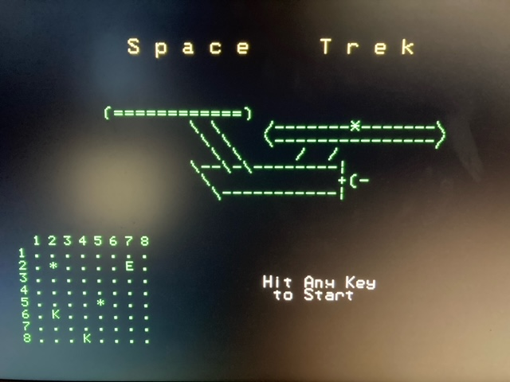

# CMM2- - SpaceTrek

A start to a Space Trek game where you need to explore the quadrant.

This program is not yet finished, but you can go around an shoot the enemy ships -- they don't fire back yet.

Instructions:
 * All commands are 3-letter commands (i.e. IMP for impulse drive)
 * Use the arrow keys to move around movement and targeting cursors
 * Spacebar will select the current object of a Targeting cursor, no need for movement cursor.
 * Enter key finishes cursor selection or movement.
 * F1 switches from Sector map to Quadrant map.

